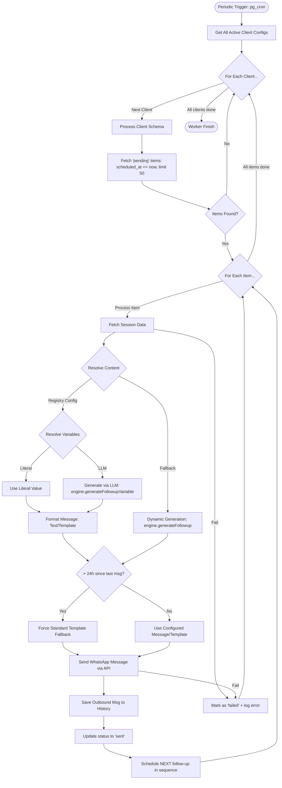

# Follow-up Processing Logic (Mermaid)

This diagram details the execution flow of the `process-followups` Supabase Edge Function, including client routing, queue management, variable resolution, and the WhatsApp 24-hour window compliance logic.

## Key Logic Components

- **Client Routing**: Uses the unified router to fetch configurations for all active clients across multiple schemas.
- **Variable Resolution**: Supports both static (literal) and dynamic (LLM-generated) variables within a follow-up.
- **24h Window Rule**: Automatically detects when the WhatsApp session window has closed and upgrades plain text follow-ups to templates to ensure delivery.
- **Sequence Management**: Triggers the scheduling of the next item in the state-defined follow-up sequence after each successful delivery.
