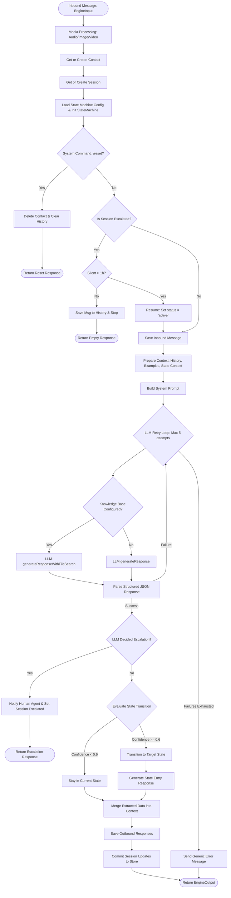

# Engine Process Message Logic (Mermaid)

This diagram details the logic flow within the `ConversationEngine.processMessage` method, which serves as the core entry point for handling inbound messages.

## Core Execution Steps

1.  **Media Processing**: Handles asynchronous operations for audio transcription (AssemblyAI/Gemini) and image analysis.
2.  **Stateful Isolation**: Each message is processed within the context of a `Session` and a `StateMachine` config specific to the client.
3.  **Self-Correction (Retry Loop)**: The engine attempts to get a valid JSON response from the LLM up to 5 times, increasing temperature on subsequent attempts to break stalemates.
4.  **Knowledge Base Integration**: If the client has a knowledge base configured, the LLM uses RAG (Retrieval-Augmented Generation) with file search to inform its response.
5.  **Autonomous Escalation**: The LLM can explicitly recommend escalating to a human agent, which triggers internal notifications and locks the session.
6.  **State Consistency**: State transitions only occur if LLM confidence exceeds 60%, ensuring stability in the conversation flow.
