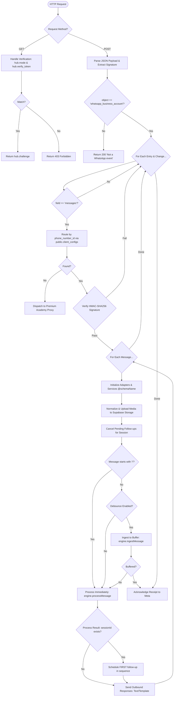

# WhatsApp Webhook Logic (Mermaid)

This diagram details the logic flow of the `webhook-whatsapp` Supabase Edge Function, which serves as the primary ingestion point for all WhatsApp interactions.

## Core Execution Steps

1.  **Multi-Tenant Routing**: Dynamically routes the request to the target schema by mapping the incoming `phone_number_id` to a `client_id` in the shared `public.client_configs` table.
2.  **Signature Verification**: Uses the client-specific `appSecret` to verify that the request originated from Meta.
3.  **Race Condition Protection**: Immediately cancels any pending follow-ups for the session as soon as a new message is received, preventing a follow-up from firing while the user is actively typing.
4.  **Media Lifecycle**: Downloads media (images, audio, video) from Meta's servers, uploads it to the client's Supabase bucket, and provides public URLs for logic processing.
5.  **Hybrid Processing**:
    *   **Debounced**: Standard messages are buffered. A separate worker (`process-pending`) processes them after a period of silence.
    *   **Immediate**: Commands (e.g., `/reset`) and fallback messages are processed in-line for instant responsiveness.
6.  **Follow-up Initialization**: For new states reached during immediate processing, the first item in the state's follow-up sequence is automatically scheduled.
